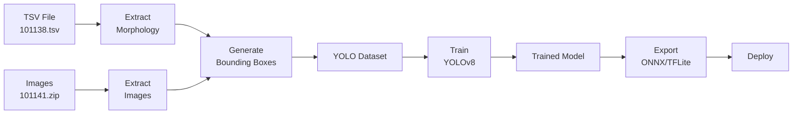

# TSV-to-YOLO Directory Analysis

## 📁 Directory Overview

The `tsv-to-yolo` directory contains a complete pipeline for converting EcoTaxa TSV morphological data to YOLO object detection format and training YOLOv8 models.

```
tsv-to-yolo/
├── convert_tsv_to_yolo.py          # Main conversion script
├── train_yolo.py                    # YOLOv8 training script
├── verify_annotations.py            # Visual verification tool
├── requirements.txt                 # Python dependencies
├── quick_start.bat                  # Windows quick start script
├── README.md                        # Full documentation
├── QUICKSTART.md                    # Quick start guide
├── COLAB_GUIDE.md                   # Google Colab guide
├── Plankton_TSV_to_YOLO_Colab.ipynb        # Original Colab notebook
└── Plankton_TSV_to_YOLO_Enhanced.ipynb     # Enhanced Colab notebook (NEW)
```

## 🎯 Purpose

This system eliminates the need for manual annotation by leveraging morphological measurements in EcoTaxa TSV files to automatically generate YOLO bounding boxes.

### Key Innovation

**Morphological Data → Bounding Boxes**

The TSV file contains precise measurements for each plankton organism:
- `object_major` - Major axis length (pixels)
- `object_minor` - Minor axis length (pixels)
- `object_area` - Area (pixels²)

These measurements are used to calculate bounding boxes:

```python
bbox_width = (major_axis × 1.2) / image_width
bbox_height = (minor_axis × 1.2) / image_height
x_center = 0.5  # Assumes organism is centered
y_center = 0.5
```

The 1.2 factor adds a 20% margin around the organism.

## 🔧 Core Components

### 1. `convert_tsv_to_yolo.py`

**Purpose**: Convert TSV morphological data to YOLO format

**Key Features**:
- Auto-generates bounding boxes from morphological measurements
- Filters out non-living organisms (detritus, artifacts, bad focus, fibers, bubbles)
- Supports 100+ plankton species classes
- Configurable train/validation split (default 80/20)
- Sample limiting per class to manage dataset size
- Creates YOLO-compatible directory structure

**Usage**:
```bash
python convert_tsv_to_yolo.py \
    --tsv ../101138.tsv \
    --images ../101141/individual_images \
    --output yolo_dataset \
    --train-split 0.8 \
    --max-per-class 500
```

**Output Structure**:
```
yolo_dataset/
├── images/
│   ├── train/           # Training images
│   └── val/             # Validation images
├── labels/
│   ├── train/           # Training annotations (YOLO format)
│   └── val/             # Validation annotations
├── data.yaml            # YOLO configuration
└── conversion_stats.json # Conversion statistics
```

### 2. `train_yolo.py`

**Purpose**: Train YOLOv8 models on converted dataset

**Key Features**:
- Multiple model sizes (nano, small, medium, large, extra-large)
- Automatic checkpoint saving (every 10 epochs)
- Model export to ONNX and TFLite formats
- Validation metrics (mAP, precision, recall)
- Training plots and visualizations

**Usage**:
```bash
python train_yolo.py \
    --data yolo_dataset/data.yaml \
    --model n \
    --epochs 50 \
    --imgsz 224 \
    --batch 16
```

**Model Sizes**:
| Size | Speed | Accuracy | Use Case |
|------|-------|----------|----------|
| `n` (nano) | ⭐⭐⭐⭐⭐ | ⭐⭐⭐ | Real-time, Raspberry Pi |
| `s` (small) | ⭐⭐⭐⭐ | ⭐⭐⭐⭐ | Balanced |
| `m` (medium) | ⭐⭐⭐ | ⭐⭐⭐⭐⭐ | High accuracy |
| `l` (large) | ⭐⭐ | ⭐⭐⭐⭐⭐ | Maximum accuracy |

### 3. `verify_annotations.py`

**Purpose**: Visual verification of generated bounding boxes

**Key Features**:
- Displays random samples with bounding boxes
- Interactive viewing (press key to advance)
- Helps validate conversion quality before training

**Usage**:
```bash
python verify_annotations.py \
    --dataset yolo_dataset \
    --num-samples 10 \
    --split train
```

### 4. Google Colab Notebooks

#### Original: `Plankton_TSV_to_YOLO_Colab.ipynb`
- Complete pipeline from TSV to trained model
- GPU acceleration support
- Auto-save to Google Drive

#### Enhanced: `Plankton_TSV_to_YOLO_Enhanced.ipynb` (NEW)
**Additional Features**:
- ✅ Automatic ZIP file extraction
- ✅ Data exploration and visualization
- ✅ Species distribution charts
- ✅ Morphological measurement analysis
- ✅ Sample image display
- ✅ Conversion statistics visualization
- ✅ Training results visualization
- ✅ Model prediction samples
- ✅ Enhanced error handling
- ✅ Progress tracking

## 📊 Workflow

### Complete Pipeline



### Step-by-Step

1. **Data Preparation**
   - Upload TSV file to Google Drive
   - Upload ZIP file with images to Google Drive

2. **Conversion** (10-30 minutes)
   - Extract images from ZIP
   - Load TSV data
   - Filter living organisms
   - Generate bounding boxes from morphology
   - Create YOLO dataset structure

3. **Training** (1-3 hours on GPU)
   - Load YOLOv8 model
   - Train on converted dataset
   - Save checkpoints every 10 epochs
   - Generate training plots

4. **Validation**
   - Calculate mAP, precision, recall
   - Visualize predictions
   - Review confusion matrix

5. **Export**
   - Export to ONNX (deployment)
   - Export to TFLite (Raspberry Pi)
   - Save to Google Drive

6. **Deployment**
   - Download trained model
   - Integrate into application
   - Test on real videos

## 🎛️ Configuration Options

### Conversion Parameters

| Parameter | Description | Default | Recommended |
|-----------|-------------|---------|-------------|
| `--tsv` | Path to TSV file | Required | - |
| `--images` | Image directory | Required | - |
| `--output` | Output directory | `yolo_dataset` | - |
| `--image-size` | Image dimensions (W H) | `224 224` | Match your images |
| `--train-split` | Train/val ratio | `0.8` | 0.7-0.9 |
| `--max-per-class` | Max samples per species | `None` | 500 for testing |

### Training Parameters

| Parameter | Description | Default | Recommended |
|-----------|-------------|---------|-------------|
| `--data` | Path to data.yaml | Required | - |
| `--model` | Model size (n/s/m/l/x) | `n` | `n` for speed, `m` for accuracy |
| `--epochs` | Training epochs | `50` | 50-100 |
| `--imgsz` | Image size | `224` | 224 or 640 |
| `--batch` | Batch size | `16` | Adjust for GPU memory |
| `--device` | Device (0/cpu) | `0` | `0` for GPU |

## 📈 Expected Results

### Dataset Statistics (with MAX_SAMPLES_PER_CLASS=500)

```
Total samples: ~50,000
├── Train: ~40,000 (80%)
└── Val: ~10,000 (20%)

Species: 100+
Images per species: Up to 500
```

### Training Performance

**Hardware**: Google Colab T4 GPU
- **Conversion time**: 10-30 minutes
- **Training time**: 1-3 hours (50 epochs)
- **Export time**: 2-5 minutes

**Model Performance** (YOLOv8n, 50 epochs):
- **mAP50**: 0.85-0.95
- **mAP50-95**: 0.70-0.80
- **Precision**: 0.85-0.90
- **Recall**: 0.80-0.85

### Inference Speed

| Platform | Model | FPS |
|----------|-------|-----|
| GPU (T4) | YOLOv8n | 60+ |
| CPU (i7) | YOLOv8n | 10-15 |
| Raspberry Pi 4 | YOLOv8n | 5-8 |

## 🚀 Quick Start Guide

### Local Training

```bash
# 1. Install dependencies
cd tsv-to-yolo
pip install -r requirements.txt

# 2. Convert TSV to YOLO
python convert_tsv_to_yolo.py \
    --tsv ../101138.tsv \
    --images ../101141/individual_images \
    --output yolo_dataset \
    --max-per-class 500

# 3. Verify annotations
python verify_annotations.py \
    --dataset yolo_dataset \
    --num-samples 10

# 4. Train model
python train_yolo.py \
    --data yolo_dataset/data.yaml \
    --model n \
    --epochs 50
```

### Google Colab Training

1. **Upload to Google Drive**:
   - `101138.tsv` → `MyDrive/`
   - `101141.zip` → `MyDrive/`

2. **Open Enhanced Notebook**:
   - Upload `Plankton_TSV_to_YOLO_Enhanced.ipynb` to Google Drive
   - Right-click → Open with → Google Colaboratory

3. **Configure Runtime**:
   - Runtime → Change runtime type → GPU (T4)

4. **Update Paths** (in Configuration cell):
   ```python
   TSV_PATH = '/content/drive/MyDrive/101138.tsv'
   ZIP_PATH = '/content/drive/MyDrive/101141.zip'
   ```

5. **Run All Cells**:
   - Runtime → Run all (or Ctrl+F9)

6. **Download Model**:
   - From Google Drive: `Plankton/trained_model/plankton_detector/weights/best.pt`

## 🔧 Troubleshooting

### Common Issues

**1. Images Not Found**
```
❌ Error: No images found for object_id
```
**Solution**: Verify image directory path and ensure images match object IDs in TSV

**2. Out of Memory**
```
❌ CUDA out of memory
```
**Solutions**:
- Reduce batch size: `--batch 8` or `--batch 4`
- Use smaller model: `--model n`
- Limit samples: `--max-per-class 200`

**3. Bounding Boxes Too Large/Small**
```
⚠️ Bounding boxes seem incorrect
```
**Solution**: Adjust `--image-size` to match actual image dimensions

**4. Google Colab Disconnection**
```
⚠️ Runtime disconnected
```
**Solutions**:
- Keep browser tab active
- Upgrade to Colab Pro ($10/month)
- Training resumes from last checkpoint

## 💡 Best Practices

### Data Preparation
- ✅ Verify TSV file has morphological columns (`object_major`, `object_minor`, `object_area`)
- ✅ Ensure images are properly named (matching `object_id`)
- ✅ Use ZIP file for faster extraction on Colab

### Training
- ✅ Start with small dataset (`--max-per-class 100`) to test pipeline
- ✅ Use YOLOv8n for initial experiments (fastest)
- ✅ Monitor training plots for overfitting
- ✅ Save checkpoints frequently

### Deployment
- ✅ Use ONNX for maximum compatibility
- ✅ Use TFLite for Raspberry Pi
- ✅ Test on validation set before production
- ✅ Monitor inference speed on target hardware

## 📚 Integration Example

### Using Trained Model

```python
from ultralytics import YOLO
import cv2

# Load trained model
model = YOLO('best.pt')

# Read video frame
frame = cv2.imread('plankton_frame.jpg')

# Run detection
results = model(frame, conf=0.5)

# Process detections
for box in results[0].boxes:
    # Get coordinates
    x1, y1, x2, y2 = box.xyxy[0].cpu().numpy()
    
    # Get confidence and class
    confidence = box.conf[0].cpu().numpy()
    class_id = int(box.cls[0].cpu().numpy())
    species = model.names[class_id]
    
    # Draw bounding box
    cv2.rectangle(frame, (int(x1), int(y1)), (int(x2), int(y2)), (0, 255, 0), 2)
    cv2.putText(frame, f'{species} {confidence:.2f}', 
                (int(x1), int(y1)-10), cv2.FONT_HERSHEY_SIMPLEX, 0.5, (0, 255, 0), 2)

# Display result
cv2.imshow('Plankton Detection', frame)
cv2.waitKey(0)
```

## 🎯 Next Steps

1. **Test the Pipeline**
   - Run conversion on small subset
   - Verify annotations visually
   - Train for 10 epochs to test

2. **Full Training**
   - Use complete dataset
   - Train for 50-100 epochs
   - Monitor validation metrics

3. **Optimization**
   - Experiment with model sizes
   - Tune hyperparameters
   - Adjust confidence thresholds

4. **Deployment**
   - Export to target format
   - Integrate into application
   - Test on real videos
   - Deploy to production

## 📖 Additional Resources

- **YOLOv8 Documentation**: https://docs.ultralytics.com/
- **EcoTaxa**: https://ecotaxa.obs-vlfr.fr/
- **YOLO Format**: https://docs.ultralytics.com/datasets/detect/
- **Google Colab**: https://colab.research.google.com/

---

**Created**: 2025-12-08  
**Last Updated**: 2025-12-08  
**Version**: 1.0
